# DeepResearchAgent 深度研究代理服务模板

[](https://www.python.org/downloads/)
[](https://fastapi.tiangolo.com/)
[](LICENSE)

DeepResearchAgent 是一个基于 ReAct (Reasoning and Acting) 框架的通用深度研究代理服务模板，内置 MCP（Model Context Protocol）工具调用框架与流式输出能力，可用于构建可插拔的研究型智能体服务。

## 核心特性

### 深度研究代理
- **多场景分类支持**: 文档阅读、问题分析、规划制定、决策建议、技术排障等
- **并行工作流处理**: 支持多分类并发执行，提高吞吐与响应效率
- **实体识别**: 自动提取关键实体与上下文信息，辅助后续检索与规划

### ReAct框架
- **推理-行动循环**: 模拟人类专家的思考和决策过程
- **工具链集成**: 丰富的MCP工具调用，支持多种专业查询
- **流式处理**: 实时流式响应，用户体验优秀

### 检索增强生成 (RAG)
- **混合检索**: 向量检索 + BM25全文检索
- **RRF融合算法**: Reciprocal Rank Fusion 优化检索结果
- **Elasticsearch集成**: 高效的向量和文本检索

### API服务
- **FastAPI框架**: 现代化、高性能的API服务
- **SSE流式响应**: Server-Sent Events 支持实时数据推送
- **外部API集成**: 支持多种第三方服务调用

## DeepResearchAgent 技术方案

### 完整工作流程

系统处理用户输入的完整流程如下图所示：

```mermaid
graph TB
    %% ==================== 用户输入与预处理 ====================
    A[用户输入] --> B{输入类型检测}
    B -->|JSON格式| C[JSON解析<br/>提取元数据/附件等]

    B -->|普通文本| D[直接作为输入]
    C --> E[存储元数据到上下文<br/>input_metadata]
    D --> E

    %% ==================== 意图识别与场景分类 ====================
    E --> F[意图识别LLM<br/>intent_recognition_llm]
    F --> G[流式解析器<br/>思考/输出分离]
    G --> H{是否触发快速响应?}
    H -->|是| I[直接返回标准答案<br/>StopEvent]
    I --> END1[返回结果<br/>结束工作流]
    H -->|否| J{判断分类模式}

    %% ==================== 场景分类机制 ====================
    J -->|单分类| K[实体识别阶段]
    J -->|多分类并行| K1[识别多个分类<br/>research-document、research-problem、research-planning 等]

    K1 --> K2[创建并行工作流管理器<br/>ParallelWorkflowManager]
    K2 --> K3{为每个分类创建}
    K3 --> K4A[分类A独立Agent实例<br/>+独立LLM+独立上下文]
    K3 --> K4B[分类B独立Agent实例<br/>+独立LLM+独立上下文]
    K3 --> K4C[分类C独立Agent实例<br/>+独立LLM+独立上下文]

    K4A --> K5[并行执行各分类工作流]
    K4B --> K5
    K4C --> K5
    K5 --> K6[等待所有分类完成或超时]
    K6 --> K7[合并各分类结果]
    K7 --> END1

    %% ==================== 实体识别阶段 ====================
    K --> L[实体识别LLM<br/>entity_recognition_llm]
    L --> M[流式解析器<br/>思考/输出分离]
    M --> N[解析JSON实体列表<br/>实体名称/类型/上下文]

    N --> O[合并识别实体到元数据<br/>_merge_entities_to_metadata]
    O --> P[按设备类型选择工作流模板<br/>get_workflow_template_by_device_type]

    %% ==================== 计划生成阶段 ====================
    P --> Q[计划生成LLM<br/>planning_llm]
    Q --> R[注入MCP工具描述+模板+元数据<br/>基于category过滤工具黑名单]
    R --> S[流式计划生成]
    S --> T[保存current_plan到上下文]

    %% ==================== ReAct推理循环核心 ====================
    T --> U[准备聊天历史<br/>prepare_chat_history]
    U --> V[格式化LLM输入<br/>系统提示+历史+推理+元数据+过滤后工具]
    V --> W[ReAct推理LLM<br/>主LLM实例]
    W --> X[流式解析器<br/>思考/行动分离]
    X --> Y{解析推理步骤}

    %% ==================== 推理步骤分支 ====================
    Y -->|工具调用 Action| Z[提取工具名称和参数]
    Y -->|里程碑 Milestone| Z1[状态更新<br/>继续推理循环]
    Y -->|完成 Final| Z2[最终答案生成]
    Y -->|解析错误| Z3[错误处理<br/>添加错误观察]

    %% ==================== 工具调用处理（MCP协议） ====================
    Z --> AA[MCP客户端连接检查<br/>ensure_connected]
    AA --> AB[发送MCP工具调用请求<br/>HTTP远程调用]
    AB --> AC{工具类型特殊处理}

    %% ==================== 混合检索工具处理 ====================
    AC -->|search_documents| AD[ES混合检索模式<br/>_es_full_text_search]

    AD --> AD1[生成查询向量 1024维]
    AD1 --> AD2[并行执行检索]
    AD2 --> AD3[向量检索kNN<br/>召回Top-20候选<br/>cosine相似度]
    AD2 --> AD4[全文检索BM25<br/>召回Top-20候选]
    AD3 --> AD5[手动RRF融合算法<br/>_manual_rrf_fusion]
    AD4 --> AD5
    AD5 --> AD6[计算RRF分数score]
    AD6 --> AD7[返回Top-15融合结果<br/>包含vector_rank+text_rank]
    AD7 --> AD8[多线程并行过滤<br/>_filter_chunks_parallel]
    AD8 --> AD9[每批3个chunk<br/>最多3个线程<br/>filter_llm判断相关性]
    AD9 --> AD10[缓存relevant_doc_chunks<br/>追加到sources]

    %% ==================== 其他工具处理 ====================
    AC --> AR[解析模型构造参数]
    AR --> AS[注入相应缓存参数]
    AS --> AI[其他mcp工具标准调用]

    AI --> AJ[标准结果处理]
    AD10 --> AJ

    %% ==================== 观察结果处理与循环 ====================
    AJ --> AK[添加ObservationReasoningStep<br/>工具观察结果]
    AK --> AL[更新推理历史<br/>current_reasoning]
    AL --> AM[工作流策略回调<br/>on_tool_call_complete]
    AM --> U
    Z1 --> U
    Z3 --> U

    %% ==================== 最终结果生成 ====================
    Z2 --> AN[构建最终响应]
    AN --> AO[包含答案+来源+推理历史]
    AO --> AQ[按分类持久化到数据库]
    AQ --> AP[StopEvent触发]
    AP --> END2[返回完整结果<br/>结束工作流]

    %% ==================== 样式定义 ====================
    classDef inputProcessing fill:#e3f2fd,stroke:#1976d2,stroke-width:2px
    classDef intentRecognition fill:#fff9c4,stroke:#f57f17,stroke-width:2px
    classDef parallelWorkflow fill:#f3e5f5,stroke:#7b1fa2,stroke-width:2px
    classDef entityRecognition fill:#c8e6c9,stroke:#388e3c,stroke-width:2px
    classDef planning fill:#dcedc8,stroke:#689f38,stroke-width:2px
    classDef reactCore fill:#bbdefb,stroke:#1565c0,stroke-width:2px
    classDef toolCall fill:#ffe0b2,stroke:#ef6c00,stroke-width:2px
    classDef hybridSearch fill:#ffccbc,stroke:#d84315,stroke-width:3px
    classDef streaming fill:#e1bee7,stroke:#6a1b9a,stroke-width:2px
    classDef errorHandling fill:#ffcdd2,stroke:#c62828,stroke-width:2px
    classDef finalResult fill:#c5e1a5,stroke:#558b2f,stroke-width:2px

    %% ==================== 应用样式 ====================
    class A,B,C,D,E inputProcessing
    class F,G,H,I,J intentRecognition
    class K1,K2,K3,K4A,K4B,K4C,K5,K6,K7 parallelWorkflow
    class K,L,M,N,O entityRecognition
    class P,Q,R,S,T planning
    class U,V,W,X,Y,Z1,Z3 reactCore
    class Z,AA,AB,AC,AJ,AK,AL,AM toolCall
    class AD,AD1,AD2,AD3,AD4,AD5,AD6,AD7,AD8,AD9,AD10 hybridSearch
    class AE,AF,AG,AH,AI,AR,AS toolCall
    class G,M,S,X streaming
    class Z3 errorHandling
    class Z2,AN,AO,AQ,AP,END1,END2 finalResult
```



### 流程说明

#### 阶段一: 用户输入与预处理

**核心功能**: 接收并解析用户输入，提取结构化信息

**代码实现**：

```python
# 检测输入类型并解析
async def preprocess_input(user_input: str) -> Dict:
    try:
        # 尝试解析为JSON格式
        parsed_data = dirtyjson.loads(user_input)
        query = parsed_data.get("query", "")
        metadata = parsed_data.get("metadata", {})
    except:
        # 普通文本格式
        query = user_input
        metadata = {}
    
    # 存储到上下文
    await ctx.store.set("user_input", query)
    await ctx.store.set("input_metadata", metadata)
    return {"query": query, "metadata": metadata}
```

**关键特性**：

1.  **容错JSON解析**: 使用`dirtyjson`库处理格式不规范的JSON输入
    
2.  **多格式支持**: 自动识别JSON/普通文本输入类型
    
3.  **上下文存储**: 通过`ctx.store`持久化用户输入和元数据
    

#### 阶段二: 分类识别与快速响应

**核心功能**: 识别用户查询意图，对标准问题快速响应，并判断所需要执行的流程分类

**代码实现**：

```python
async def recognize_intent(user_input: str) -> str:
    # 调用Intent LLM(流式)
    response_stream = await intent_recognition_llm.stream_chat([
        {"role": "system", "content": INTENT_RECOGNITION_TEMPLATE},
        {"role": "user", "content": user_input}
    ])
    
    # 实时解析思考和输出
    parser = StreamingResponseParser()
    async for chunk in response_stream:
        thinking, output = parser.parse(chunk)  # 分离 <think>思考</think> 和输出
        if thinking:
            await sse_manager.send_event("thinking", {"content": thinking})
    
    # 快速响应判断
    if is_standard_question(intent_result):
        return StopEvent(result=get_standard_answer(intent_result))
```

**快速响应机制**: 识别到标准问题直接返回`StopEvent`,跳过后续推理

**自动分类**: 根据用户需求类型自动标注 workflow 分类（如 research-document / research-problem / research-planning）

#### 阶段三: 实体识别

**核心功能**: 从自然语言中提取结构化实体信息

**输出示例**：

```json
[{"entity_name":"React","entity_type":"技术","context_info":"对比与选型","entity_category":"技术"}]
```

#### 阶段四: 计划生成

**核心功能**: 根据设备类型和分类，参考历史的执行计划示例，生成新的执行计划

**生成计划示例**：

```plaintext
【执行计划】针对“如何设计一个可插拔的深度研究代理服务？”
- [ ] 使用 `search_documents` 工具检索与问题相关的资料片段
- [ ] 使用 `conclude_document_chunks` 工具对检索到的片段做归纳总结
- [ ] 基于总结结果输出结构化结论与建议
```

#### 阶段五: ReAct推理循环

**工作原理**: AI自主推理、工具调用、结果观察的迭代循环

```python
async def react_reasoning_loop(user_input: str, category: str):
    max_iterations = 50
    iteration = 0
    
    while iteration < max_iterations:
        iteration += 1
        
        # 1. 准备聊天历史
        chat_history = await prepare_chat_history(ctx)
        
        # 2. 调用Main LLM(流式)
        response_stream = await main_llm.stream_chat(messages)
        
        # 3. 实时解析推理步骤
        parser = customReActOutputParser()
        async for chunk in response_stream:
            thinking, action = parser.parse(chunk)
            if thinking:
                await sse_manager.send_event("thinking", {"content": thinking})
        
        # 4. 根据推理步骤执行
        if isinstance(reasoning_step, ActionReasoningStep):
            await handle_tool_call(ctx, reasoning_step)  # 工具调用
        elif reasoning_step.is_done:
            return StopEvent(result=reasoning_step.response)  # 完成
```

**推理循环示例**：

```plaintext
第1轮: 思考→需要检索相关文档 | 行动→调用检索工具 | 观察→获得15个文档
第2轮: 思考→需要提取关联设备 | 行动→调用提取工具 | 观察→获得关联电厂列表
第3轮: 思考→信息充足 | 行动→调用结论生成 | 观察→生成完整答案
第4轮: 思考→任务完成 | 行动→Finish | 推理循环结束
```

#### 阶段六: 混合检索

**核心技术**: 向量检索 + 全文检索 + RRF融合

**代码实现**：

```python
async def hybrid_search(query: str, category: str):
    # 1. 生成查询向量(1024维)
    query_vector = embedder._get_query_embedding(query)
    
    # 2.1 向量检索 (kNN)
    vector_results = await es_client.search({
        "knn": {"field": "embedding", "query_vector": query_vector, "k": 50}
    })
    
    # 2.2 全文检索 (BM25)
    text_results = await es_client.search({
        "query": {"bool": {"must": [{"match": {"chunk": query}}]}}
    })
    
    # 3. RRF融合
    return _manual_rrf_fusion(vector_results, text_results, k=10, top_n=15)
```

**RRF融合算法**：

```python
def _manual_rrf_fusion(vector_results, text_results, k=10, top_n=15):
    # 公式: score(d) = Σ [1 / (k + rank_i(d))]
    for item in vector_results:
        doc_dict[doc_id]['rrf_score'] += 1.0 / (k + item['vector_rank'])
    for item in text_results:
        doc_dict[doc_id]['rrf_score'] += 1.0 / (k + item['text_rank'])
    # 按RRF分数排序,返回Top-N
    return sorted_docs[:top_n]
```

**关键特性**：

1.  **双路并行检索**: 向量检索(kNN + Cosine, Top-50候选) + 全文检索(BM25, Top-50候选)
    
2.  **向量模型**: Qwen3-Embedding-8B,生成1024维向量
    
3.  **手动RRF融合**: 因ES 9.0+ RRF需商业许可证,实现手动融合算法 `score = 1/(k+rank)`
    
4.  **分类索引**: `_get_dynamic_es_index(category)`根据分类动态切换ES索引
    
5.  **可配置参数**: `ES_VECTOR_CANDIDATES`（向量检索候选数）, `ES_TEXT_CANDIDATES`（全文检索候选数）, `ES_RRF_K`（RRF平滑常数）, `ES_SEARCH_SIZE`（最终返回Top-N）

#### 阶段七: 文档过滤

**核心功能**: 使用LLM判断文档相关性,多线程并行处理

**代码实现**：

```python
async def _filter_chunks_parallel(doc_chunks, query, category):
    # 多线程并行过滤
    with ThreadPoolExecutor(max_workers=3) as executor:
        futures = [executor.submit(_filter_single_chunk, chunk, query) 
                   for chunk in doc_chunks]
        
        for future, idx in futures:
            is_relevant, thinking = future.result()
            # 发送实时进度
            await sse_manager.send_event("filter_progress", 
                                        {"current": idx+1, "total": len(doc_chunks)})
```

**多线程并行**: `ThreadPoolExecutor(max_workers=3)`最多3个线程同时处理

**线程专属LLM**: 每个线程创建独立的`filter_llm`实例，避免线程安全问题

#### 阶段八: 结论生成

**核心功能**: 基于过滤后的文档生成最终答案

**代码实现**：

```python
async def generate_conclusion(doc_chunks, query):
    # 调用Conclusion LLM
    conclusion = await conclusion_llm.stream_chat([
        {"role": "system", "content": CONCLUSION_SYSTEM_PROMPT},
        {"role": "user", "content": f"文档:{doc_chunks}\n问题:{query}"}
    ])
    # SSE流式返回
    async for chunk in conclusion:
        await sse_manager.send_event("streaming_content", {"content": chunk})
```

**文档注入**: 将缓存的`relevant_doc_chunks`注入到提示词

**来源追踪**: 返回结果包含`sources`字段,记录文档来源

## 快速开始

### 环境要求

- Python 3.10+
- PostgreSQL (推荐 13+)
- Elasticsearch 7.0+
- Redis (可选，用于缓存)

### 1. 克隆项目

```bash
git clone https://github.com/Apple-Blossom23/DeepResearchAgent.git
cd DeepResearchAgent
```

### 2. 创建虚拟环境

```bash
# 使用 venv
python -m venv .venv
.venv\Scripts\activate  # Windows
# 或
source .venv/bin/activate  # macOS/Linux

# 或使用 conda
conda create -n deep_research python=3.10
conda activate deep_research
```

### 3. 安装依赖

```bash
pip install -r requirements.txt
```

### 4. 配置环境变量

复制 `.env.example` 为 `.env` 并配置：

```bash
cp .env.example .env
```

编辑 `.env` 文件：

```env
# 环境配置
ENV=local  # local/dev/prod

# API配置
DASHSCOPE_API_KEY=your_api_key_here
DASHSCOPE_BASE_URL=https://your-api-base-url

# 模型配置
DEFAULT_MODEL_NAME=your_default_model
PLANNING_MODEL_NAME=your_planning_model
CONCLUSION_MODEL_NAME=your_conclusion_model
FILTER_MODEL_NAME=your_filter_model

# 嵌入模型配置
EMBEDDING_ONLINE_URL=https://your-embedding-url

# 数据库配置
DB_HOST=localhost
DB_PORT=5432
DB_NAME=postgres_dev
DB_USER=postgres
DB_PASSWORD=your_db_password

# Elasticsearch配置
ES_HOST=localhost
ES_PORT=9200
ES_INDEX=your_index

ES_AUTH=Basic base64_credentials

# MCP配置
MCP_SERVER_HOST=0.0.0.0
MCP_SERVER_PORT=8988
```

### 5. 初始化数据库

```bash
# 运行数据库迁移
python -c "
from db_pool_manager import DatabasePoolManager
import asyncio
asyncio.run(DatabasePoolManager.initialize_pools())
"
```

### 6. 启动服务

#### 开发模式

```bash
# 启动主服务
python run.py

# 或使用启动脚本
bash start_dev.sh
```

#### 生产模式

```bash
# 使用生产启动脚本
bash start_prod.sh
```

### 7. 访问应用

- **mcp服务端**: http://localhost:8988
- **web界面**: http://localhost:8989/static/index.html

## 使用指南

### 基本用法

#### 1. 命令行模式

```python
# 直接运行主程序
python run.py

```

#### 2. SSE流式响应

```javascript
const eventSource = new EventSource('http://localhost:8000/api/stream');

eventSource.onmessage = function(event) {
    const data = JSON.parse(event.data);
    console.log('收到:', data);
};

eventSource.onerror = function(event) {
    console.log('连接错误');
};
```

### 高级功能

#### 自定义工作流模板

在 `workflow_templates.py` 中定义自定义模板：

```python
CUSTOM_TEMPLATE = {
    "name": "custom_workflow",
    "description": "自定义工作流程",
    "steps": [
        {"type": "tool_call", "tool": "custom_tool"},
        {"type": "reasoning", "prompt": "custom_prompt"}
    ]
}
```

#### 工具配置

通过 `config.py` 的 `TOOL_WHITELIST_MAPPING` 控制不同 workflow 分类允许调用的 MCP 工具。

```python
TOOL_WHITELIST_MAPPING = {
    "research-general": [
        "search_documents",
        "conclude_document_chunks",
    ],
    "technical-troubleshooting": [
        "search_documents",
        "conclude_document_chunks",
    ],
    "default": [
        "search_documents",
        "conclude_document_chunks",
    ],
}
```

#### 调试模式

```bash
# 启用详细日志
export LOG_LEVEL=DEBUG

# 运行服务
python run.py
```

## 测试

### 运行测试套件

```bash
# 运行所有测试
pytest tests/

# 运行特定测试
pytest tests/test_sse_manager.py -v

# 运行覆盖率测试
pytest --cov=. tests/
```

### 性能测试

```bash
# 运行评估测试
python eval_runner.py
```

## 📁 项目结构

```
DeepResearchAgent/
├── ReAct_Workflow.py           # ReAct工作流引擎
├── ReAct_Events.py             # 事件处理
├── ReAct_Tools.py              # 工具定义（通过MCP调用）
├── tools.py                    # MCP工具服务端（FastMCP）
├── fast_mcp_client.py          # MCP客户端
├── workflow_*.py               # 工作流相关
├── web/                        # Web界面
│   ├── app.js                  # 前端逻辑
│   ├── index.html              # 主页面
│   └── styles.css              # 样式文件
├── 📁 db/                      # 数据库
│   └── migrations/             # 数据库迁移
├── 📁 tests/                   # 测试文件
├── 📁 scripts/                 # 脚本工具
├── 📄 run.py                   # 主启动文件
├── 📄 external_api_server.py   # 外部API服务
├── 📄 config.py                # 配置管理
├── 📄 requirements.txt         # 依赖列表
└── 📄 README.md               # 项目文档
```

## 🔧 配置说明

### 环境变量配置

| 变量名 | 说明 | 示例值 | 必需 |
|--------|------|--------|------|
| `ENV` | 运行环境 | local/dev/prod | ✅ |
| `DASHSCOPE_API_KEY` | API密钥 | your_key | ✅ |
| `DB_HOST` | 数据库主机 | localhost | ✅ |
| `ES_HOST` | Elasticsearch主机 | localhost | ✅ |
| `DEFAULT_MODEL_NAME` | 默认模型名称 | your_model | ✅ |

### 数据库配置

```sql
-- 创建数据库
CREATE DATABASE postgres_dev;

-- 创建用户
CREATE USER postgres WITH PASSWORD 'your_password';

-- 授权
GRANT ALL PRIVILEGES ON DATABASE postgres_dev TO postgres;
```

### Elasticsearch配置

```bash
# 安装Elasticsearch (Docker)
docker run -d \
  --name elasticsearch \
  -p 9200:9200 \
  -p 9300:9300 \
  -e "discovery.type=single-node" \
  -e "xpack.security.enabled=false" \
  elasticsearch:7.17.0
```

## 🛠️ 开发指南

### 添加新工具

1. 在 `ReAct_Tools.py` 中定义工具
2. 在配置中添加工具描述
3. 更新工具白名单映射

### 自定义工作流

1. 创建工作流模板类
2. 定义步骤序列
3. 配置LLM参数

### 调试模式

```bash
# 启用详细日志
export LOG_LEVEL=DEBUG

# 运行服务
python run.py
